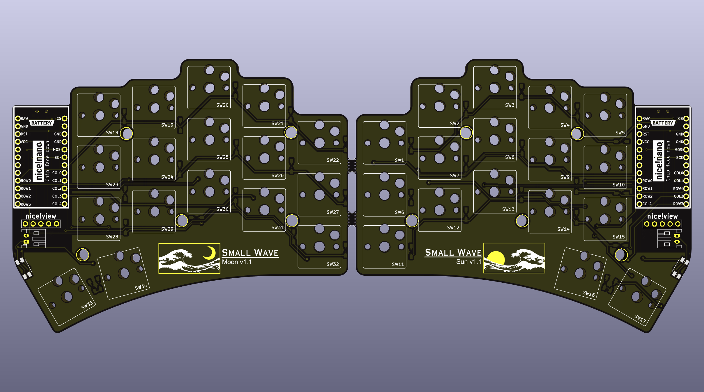

# smallwave

  
  
  
  

The smallwave is a 34 key wireless split keyboard with a e-paper style display.
This design ultimately comes from the popular [Sweep](https://github.com/davidphilipbarr/Sweep) layout but was built by modifying the [Urchin](https://github.com/duckyb/uchin) design and inspired by many aspects of the [Flipper](https://github.com/benvallack/the-flipper) and Corne layout.

## Hardware List
#### Required Parts
- 1× smallwave PCB (files can be found in the gerbers folder)
- 2× nice!nano
- 2× Lipo battery
- 48× Mill-max machined pins
- 2× Pair of female headers
- 34× Kailh choc hotswap sockets
- 34× Kailh choc v1 switches
- 34× Keycaps
- 34× SMD diodes

#### Optional Parts
- 2x nice!view
- 12x Vinyl self adhesive pads
- 2x Magnetic type C cable
- 1x Dual port USB wall charger

#### Itemized Parts Receipt (v1.0 build)
| Quantity | Item | Source | Cost |
| :---: | --- | --- | --- |
| 2 | nice!nano | typeractive.xyz | $50.00 |
| 2 | nice!view | typeractive.xyz | $40.00 |
| 40 | SMD Diode | typeractive.xyz | $3.00 |
| 40 | Kailh Hotswap Sockets | typeractive.xyz | $6.00 |
| 40 | Kailh Low Profile Choc Switches (Pro Red) | typeractive.xyz | $28.00 |
| 4 | MBK Choc Keycaps (1u convex) | typeractive.xyz | $2.00 |
| 2 | MBK Choc Keycaps (1u homing) | typeractive.xyz | $1.00 |
| 30 | MBK Choc Keycaps (1u) | typeractive.xyz | $10.50 |
| 4 | Machine Sockets and Pins | typeractive.xyz | $13.00 |
| 2 | Reset Button | typeractive.xyz | $1.50 |
| 2 | Battery Jack (black) | typeractive.xyz | $2.00 |
| 2 | Power Switch | typeractive.zyz | $1.50 |
| 2 | Lithium Battery 110mAh (BLK PH 2.0mm) | typeractive.xyz | $8.00 |
| 5 | smallwave PCB | jlcpcb.com | $38.93 |
| 16 | Vinyl Self Adhesive Pads (round 3/8") | Ace Hardware | $4.99 |
| 2 | Magnetic Type C Cable | amazon.com | $14.99 |
| 1 | Anker PowerPort Mini Dual Port USB Wall Charger | amazon.com | $6.99 |

## Design Software
#### KiCad
PCB design, part locations, copper traces, and pads. This was a steep learning curve for me but the software was incredible once I got the hang of it.
#### AutoCAD
PCB shape (edge cuts). This can be done in KiCad but I am inexperienced with the software and felt much more comfortable drawing prototype shapes in a software I am more familiar with.
#### Inkscape
Used for making the PCB art through the use of SVG files. 
#### Github
Used for programming the keyboard in the ZMK language directly in the web browser. How cool is that? More on this below.

## Firmware
The smallwave utilizes the ZMK programming language. To view, download, or edit the zmk programming used for this project, visit the [zmk-config-smallwave repository](https://github.com/rosennx6/zmk-config-smallwave).

## Inspiration/Credits
This build was inspired by the Ferris Sweep, Ben Vallack's Flipper, and Duccio's Urchin. I started this project with zero knowledge of keyboards, PCBs, or programming but, along with browsing [r/ErgoMechKeyboards](https://www.reddit.com/r/ErgoMechKeyboards/) the videos below were very helpful for me in getting started.
- [You Won't Beleive How Effective This Keyboard Layout Is](https://youtu.be/8wZ8FRwOzhU?si=EpPOE7a2gVTnpphz)
- [A Tiny, Ultra-Affordable Keyboard You Can Build Yourself!](https://youtu.be/JqpBKuEVinw?si=qibRUbN7NvYlW7R7)
- [How to make a SWEEP KEYBOARD (beginner friendly!)](https://youtu.be/fBPu7AyDtkM?si=BP1d7TfXiWL5cw6Q)
- [URCHIN Ergonomic Keyboard Build](https://youtu.be/CHSh1-dJq24?si=E14KtWMmz5-_V5mR)
- [PCB Art - A Step By Step Tutorial](https://youtu.be/vD6es-Y4LLc?si=0AxjCWdZhJgSs7d_)
- [Beginner ZMK Tutorial - How to make and modify your ZMK keymap](https://youtu.be/Kx8F4xI5yno?si=BYquHvFE0kq7FGJF)
- [How to Set Up ZMK Firmware From Scratch](https://youtu.be/O_urj-rF3bQ?si=-QcN1Bxoi7COPyYP)
