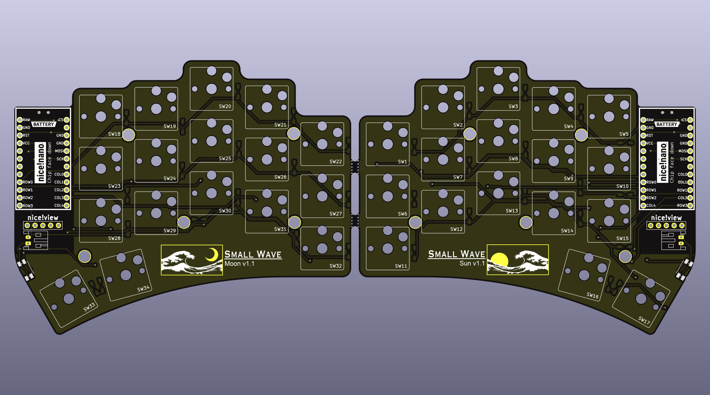

# smallwave

  
  
  
  

This design was inspired by Urchin and Flipper designs.

> **Warning**
> This repository is currently under construction. Files and descriptions are not complete at this time.

## Parts List
#### Required Parts
- 1× smallwave PCB (files can be found in the gerbers folder)
- 2× nice!nano
- 2× Lipo battery
- 48× Mill-max machined pins
- 2× Pair of female headers
- 34× Kailh choc hotswap sockets
- 34× Kailh choc v1 switches
- 34× Keycaps
- 34× SMD diodes

#### Optional Parts
- 2x nice!view
- 12x Vinyl self adhesive pads
- 2x Magnetic type C cable
- 1x Dual port USB wall charger

#### Itemized Parts Receipt (v1.0 build)
| Quantity | Item | Source | Cost |
| :---: | --- | --- | --- |
| 2 | nice!nano | typeractive.xyz | $50.00 |
| 2 | nice!view | typeractive.xyz | $40.00 |
| 40 | SMD Diode | typeractive.xyz | $3.00 |
| 40 | Kailh Hotswap Sockets | typeractive.xyz | $6.00 |
| 40 | Kailh Low Profile Choc Switches (Pro Red) | typeractive.xyz | $28.00 |
| 4 | MBK Choc Keycaps (1u convex) | typeractive.xyz | $2.00 |
| 2 | MBK Choc Keycaps (1u homing) | typeractive.xyz | $1.00 |
| 30 | MBK Choc Keycaps (1u) | typeractive.xyz | $10.50 |
| 4 | Machine Sockets and Pins | typeractive.xyz | $13.00 |
| 2 | Reset Button | typeractive.xyz | $1.50 |
| 2 | Battery Jack (black) | typeractive.xyz | $2.00 |
| 2 | Power Switch | typeractive.zyz | $1.50 |
| 2 | Lithium Battery 110mAh (BLK PH 2.0mm) | typeractive.xyz | $8.00 |
| 5 | smallwave PCB | jlcpcb.com | $38.93 |
| 16 | Vinyl Self Adhesive Pads (round 3/8") | Ace Hardware | $4.99 |
| 2 | Magnetic Type C Cable | amazon.com | $14.99 |
| 1 | Anker PowerPort Mini Dual Port USB Wall Charger | amazon.com | $6.99 |

## Build Guide
Pending.

## Firmware
The smallwave utilizes the ZMK programming language. To view, download, or edit the zmk programming used for this project, visit the [zmk-config-smallwave repository](https://github.com/rosennx6/zmk-config-smallwave) and follow the provided instructions.
